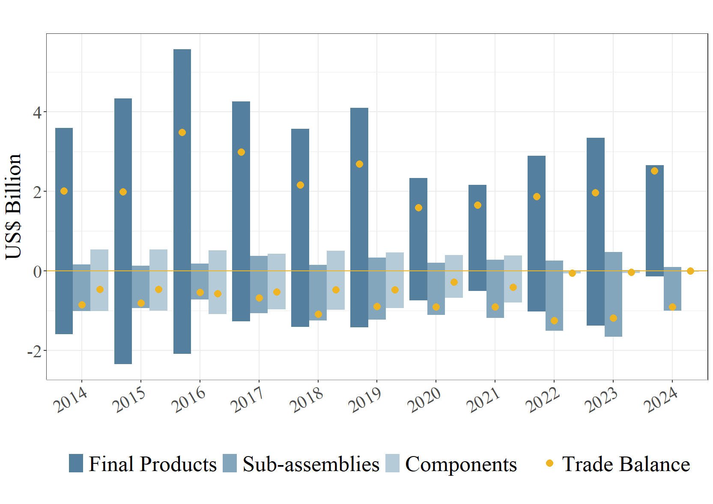

# Brasil

Balança Comercial do Brasil de Produtos Aeroespaciais.
```{r}
#| echo: false
#| out.width: "80%"
#| fig-cap: "Fonte: COMTRADE (2025)"




```
<a href="https://drive.google.com/file/d/1I4BOZkBmz46eP_RYRgoQCkWeXuR9PnUu/view?usp=sharing" target="_blank"> PDF </a>    <a href="https://drive.google.com/file/d/1E27_-aU7je-DA_7Vu4O1fYxf4MywU6ew/view?usp=sharing" target="_blank"> PNG  </a>

